Abstract

cách nghiên cứu trước tập trung vào 2 loại:

- white-box: biết rõ mô hình teacher nhưng thường có số lượng tham số lớn, toán bộ chi tiết về kiến trúc mô hình (số lớp, các tham số) được biết đến

- black-box: không biết rõ mô hình teacher nhưng có số lượng tham số rất lớn, chỉ biết được đầu ra text, ví dụ là sử dụng API của ChatGPT

Chưa có nhiều nghiên cứu về cách để chắt lọc hiệu quả kiến thức về LLM hộp trắng thành các mô hình nhỏ, điều này là tối quan trọng trong môi trường open-source LLM

Nghiên cứu này đề xuất phương pháp KD để chắt lọc LLM thành các mô hình ngôn ngữ nhỏ hơn

Tác giả thay thế forward Kullback-Leibler divergence bằng reverse KLD, phù hợp hơn với KD trên các mô hình ngôn ngữ tạo sinh, để ngăn mô hình student đánh giá quá cao các vùng có xác suất thấp của sự phân bố giáo viên. Sau đó, tác giả rút ra một phương pháp tối ưu hóa hiệu quả để học hàm mục tiêu này

Kết quả của việc áp dụng reverse KLD làm cho mô hình student tạo phàn hồi chính xác hơn, có exposure bias thấp hơn (lỗi lúc sử dụng mô hình để sinh văn bản, mô hình không còn có gound truth để dựa vào nữa, phải tự dựa vào các từ mà chính nó đã sinh ra ở các bước trước. Nếu các từ này sai hoặc không chính xác, chúng có thể làm ngữ cảnh bị lệch, dẫn đến việc tạo ra nhiều lỗi hơn ở các bước tiếp theo), better calibration (có phân phối đầu ra của mô hình gần giống với phân phối thực tế), hiệu suất đối với văn bản dài cao hơn 

1. Introduction

Việc giảm foward KLD khiến qθ (student model, qθ nên đơi giản hơn vì studnet model có số lượng tham số ít hơn) gán xác suất cao bất hợp lý cho các vùng trống của p (teacher model, p của teacher model phức tạp hơn nhiều do chúng có nhiều tham số hơn) và tạo ra các mẫu rất khó xảy ra dưới p trong quá trình sinh tự do

KD objectives thông thường không phù hợp cho mô hình LLMs vì số lượng next token phải dự đoán là quá lớn

minimizing KL[qθ ||p] causes qθ to seek the major modes of p, and assign low probabilities to p’s void regions

mô hình student tránh học quá nhiều biến thế trong phân phối của mô hình teacher và tập trung vào tính chính xác của các nội dung được tạo ra, điều này rất quan trọng trong các trường hợp đòi hỏi độ trung thực và độ tin cậy

reverse KLD đã được sử dụng trong computer vision (Self-Knowledge Distillation via Dropout) và reinforcement learning (Distilling Policy Distillation)

suy ra gradient của objective với Policy Gradient (Policy Gradient Methods for Reinforcement Learning with Function Approximation)

để ổn định và tăng tốc quá trình huấn luyện, tác giả đã:

- single-step decomposition (phân rã một bước) to reduce variance

- teacher-mixed sampling to alleviate (giảm bớt) reward hacking

- length normalization to eliminate the length bias

2. Method

2.1 MiniLLM: Knowledge Distillation with Reverse KLD

MiniLLM lấy động lực từ Inverse Reinforcement Learning (Maximum Entropy Inverse Reinforcement Learning)

Rsearch question: Tại sao không huấn luyện mô hình bằng gradient descent với hàm mất mát là tổng các reverse KLD giữa teacher và student trên từng token? Nếu làm theo các này thì có nhược điểm gì? => vì hàm loss này phụ thuộc phần lớn vào student (chưa biết gì), do đó phải tính gradient của hàm loss để phân tích và khắc phụ nhược điểm này

2.2 Optimization with Policy Gradient

Bằng cách sử dụng Policy Gradient Theorem, tác giả suy ra được gradient của objective function  như sau:

các nhược điểm:

- policy gradient có phương sai lớn và reward hacking

- Rt thích câu ngắn hơn

Single-Step Decomposition

gradient của hàm loss có thể phân tích thành gradient của lỗi tại bước hiện tại và gradient của lỗi với những token tương lai

Teacher-Mixed Sampling

khi thực nghiệm tác giả nhận thấy hiện tượng reward hacking, khi mà mô hình student tạo ra các câu thoái hóa y có điểm cao từ teacher trong quá trình lấy mẫu (các cụm từ lặp đi lặp lại)

để giải quyết vấn đề này, tác giả thay thể phản hồi từ teacher bằng mix phản hồi của teacher và chính mô hình

Length Normalization

câu dài thì có R(t+1) nhỏ, khuyến khích mô hình sinh ra những phản hồi ngắn

do đó tác giả thay thế R(t+1) bằng R_Norm(t+1)

Tổng kết, tác giả đề xuất cách tính gradient của hàm loss để tối thiểu hóa hàm loss như sau:

2.3 Training Algorithm

mô hình student được lấy từ những mô hình pretrained trên một bộ large long-document corpus Dpt

mô hình teacher là LLM đã được fine-tuned trên dataset D, hoặc được cho là tốt với tác vụ sinh văn bản

mô hình student sau đó được fine-tuned cho tác vụ sinh văn bản với dataset D trước; Sau lại được fine-tuned với phản hồi từ teacher và cả dataset D

3.Experiments

3.1 Experimental Setup

Base Models

- students: GPT-2 (120M, 340M, 760M), OPT (1.3B, 2.7B, 6.7B), LLaMA (7B)

- teachers: GPT-2-1.5B, GPT-J,        OPT-13B,                LLaMA-13B

Training

- D: databricks-dolly-15K, lọc những examples có độ dài lớn hơn context length của mô hình, 12.5K for training, 1K for validation, 0.5 for testing

- Dpt: OpenWebText for GPT-2 family, RoBERTa training corpus for other models

- teacher-mix-in strength = 0.2

- Validation: Rouge-L scores để tìm kiếm parameters và hyper-parameters tốt nhất, vì nó đã được thực nghiệm là tốt hơn so với validation losses (Benchmarking generalization via in-context instructions on 1,600+ language tasks)

Evaluation

- DollyEval: 500 samples test from databricks-dolly-15k

- SelfInst: 252 samples about user-oriented instruction-following

- VicunaEval: 80 challenging questions trong Vicuna evaluation

- S-NI: test set của SUPER-NaturalInstructions bao gồm 9K samples của 119 tác vụ. Theo như bài báo (Instruction tuning with GPT-4), tác giả chia thành 3 tập nhỏ với độ dài của ground truth response là [0, 5], [6, 10], [11, +∞]

- UnNI: lấy ngẫu nhiên 10K samples từ UnNaturalInstruction, tương tự như S-NI chia thành 3 tập nhỏ tương tự

Tác giả sử dụng 3 metrics để so sách các mô hình:

- Rouge-L

- GPT4: sử dụng GPT4 để chấm điểm 1-10 cho phản hồi từ mô hình. So sánh với các mô hình khác và ground truth. Chỉ được áp dụng cho DollyEval, SelfInst, VicunnaEval (ít samples)

- Human Evaluation: thực hiện trên SelfInst, người đánh giá được yêu cầu đưa ra nhãn là "Win", "Tie", "Loss" với 2 phản hồi từ 2 mô hình

khi đánh giá trên tập test, sự dụng temperature = 1, kết quả là trung bình của 5 phản hồì từ mô hình với random seeds khác nhau

Baselines:

- SFT w/o KD: không sử dụng knowledge disstillation, chỉ fine-tuned student trên D

- KD: fune-tunes student trên D sử dụng phân phối của teacher tại mỗi token step (word-level KD)

- SeqKD: fine-tunes student với nhãn được sinh ra bởi teacher

3.2 Results

MiniLMM có đa phần có kết quả tốt hơn các baselines khác trong mọi trường hợp

MiniLMM hoạt động tốt hơn nhiều số với các baselines khác với test dataset khác với Dolly, cho thấy sự tổng quát hóa ngoài phân phối tốt (out-of-distribution generalization)

Trong vài trường hợp trên Vicuna, S-NI và UnNI, student còn có kết quả Rouge-L tốt hơn teacher. Tác giả phỏng đoán rằng việc fine-tune standard teacher-forcing trên D mang lại sự khác biệt trong quá trình training và suy luận cho mô hình giáo viên (exposure bias). Nhờ vào policy optimization, student có thể giảm exposure bias này đi

Khi số lượng tham số của mô hình tăng thì chất lượng cũng tăng theo

3.3 Analysis

Scaling Law of Teacher

Thông thường huấn luyện mô hình student với teacher lớn hơn sẽ có kết quả student tốt hơn, tuy nhiên điều này không phải lúc nào cũng đúng, thậm chí có thể làm ảnh hưởng đến hiệu năng distillation, để so sánh khả năng scale up của teacher, tác giả so sánh MiniLMM với SeqKD

Exposure Bias

lỗi lúc sử dụng mô hình để sinh văn bản, mô hình không còn có gound truth để dựa vào nữa, phải tự dựa vào các từ mà chính nó đã sinh ra ở các bước trước. Nếu các từ này sai hoặc không chính xác, chúng có thể làm ngữ cảnh bị lệch, dẫn đến việc tạo ra nhiều lỗi hơn ở các bước tiếp theo

khi student được huấn luyện student bằng MiniLLM, student xem những samples được tạo ra bởi chính nó (thể hiện ở chỗ nào trong hàm loss?) nên giảm bớt được exposure bias

tác giả sử dụng metric ExAccErr để đo tích lũy lỗi exposure bias

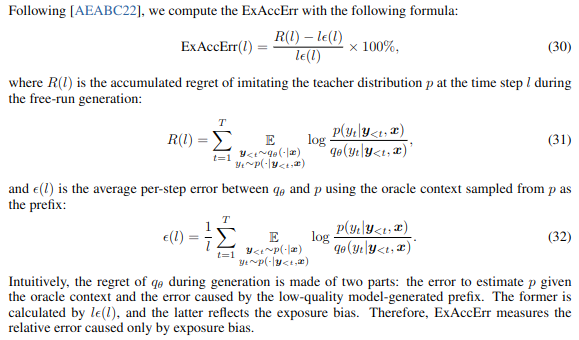

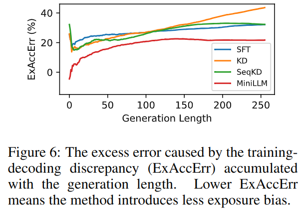

với MiniLLM ExAccErr ngừng tăng khi số lượng token > 150

Calibration

- các mô hình được huấn luyện với policy optimization có thể có hiệu chuẩn (calibration) kém (xác suất dự đoán không phản ánh đúng độ chắc chắn thực tế, phản hồi quá tự tin trong khi sai, đưa ra xác suất thấp cho các câu trả lời đúng)

- sử dụng ECE scores

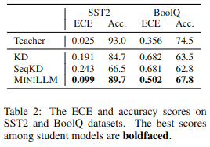

Phương pháp KD và SeqKD có hiệu chuẩn thấp

Performance on Different Response Length

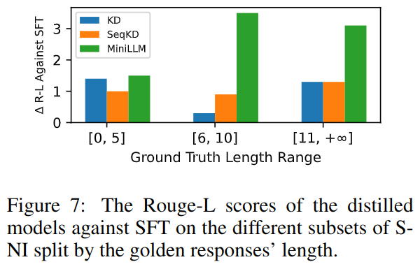

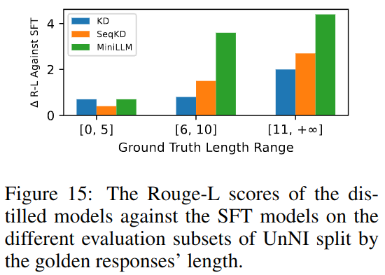

Generation Diversity

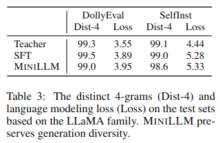

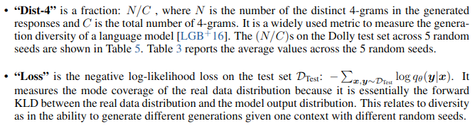

3.4 Ablation Studies on Optimization Strategies

Effect of Teacher-Mix-in Strength

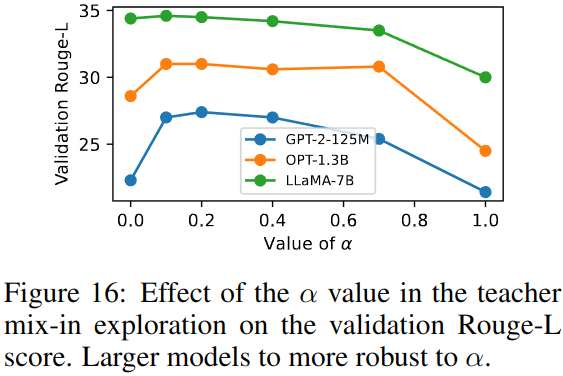

Effect of Adding Pre-Training Loss

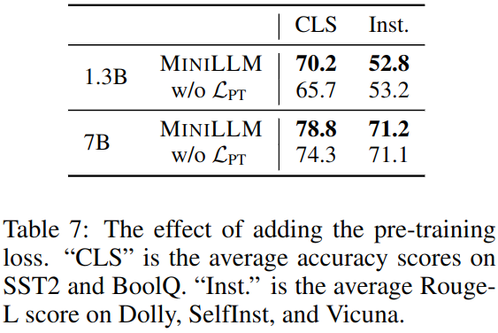

----

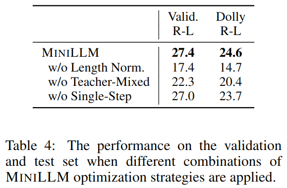

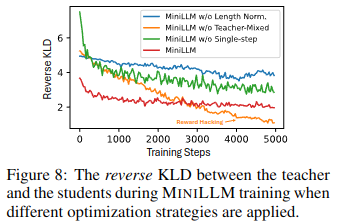

Một ví dụ trực quan

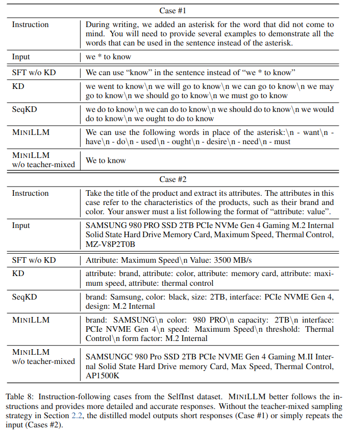

A Derivations

A.1 A Perspective of MiniLLM from Inverse Reinforcement Learning

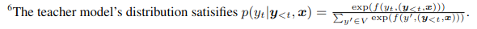

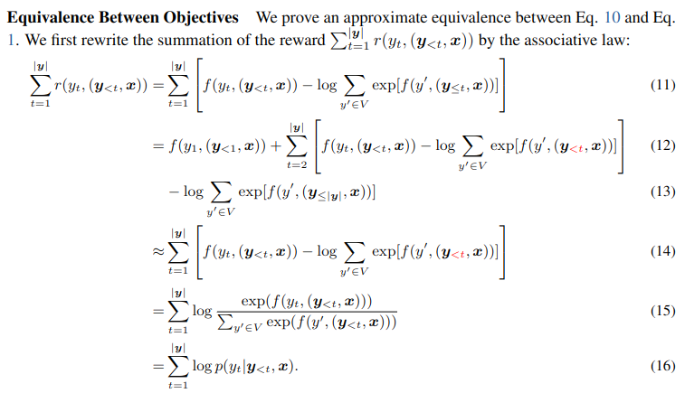

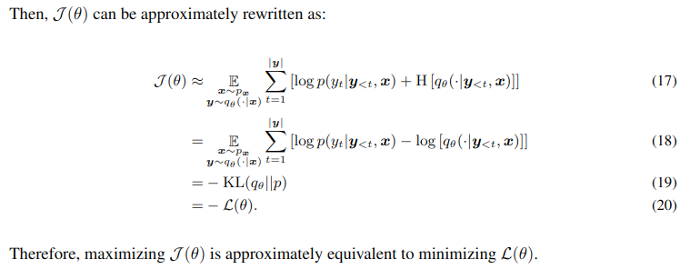

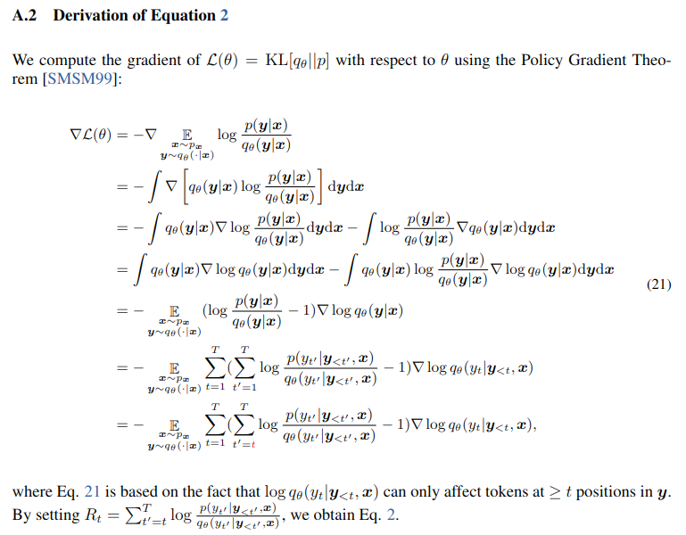

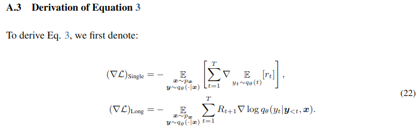

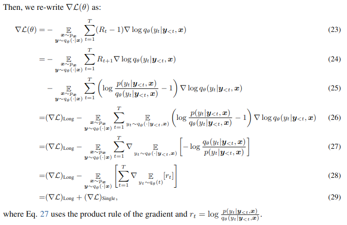